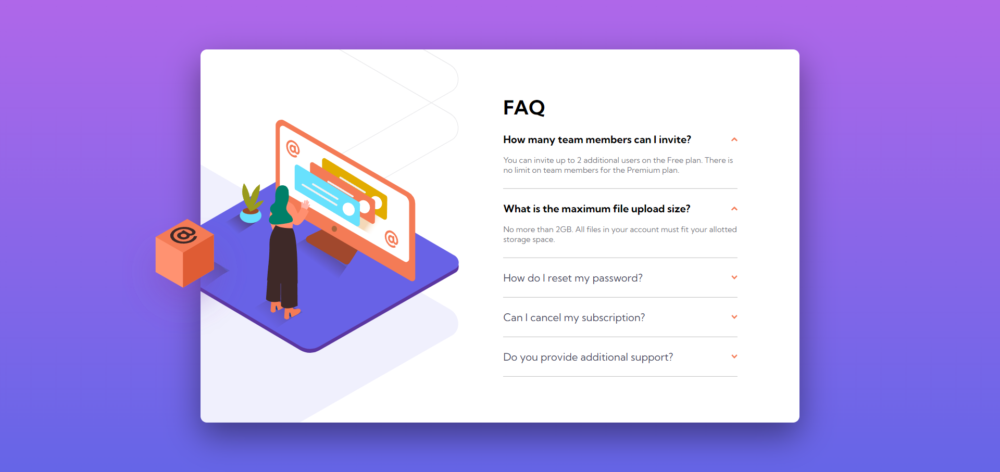

# Frontend Mentor - FAQ accordion card solution

This is a solution to the [FAQ accordion card challenge on Frontend Mentor](https://www.frontendmentor.io/challenges/faq-accordion-card-XlyjD0Oam). Frontend Mentor challenges help you improve your coding skills by building realistic projects. 

## Table of contents

- [Overview](#overview)
  - [The challenge](#the-challenge)
  - [Screenshot](#screenshot)
  - [Links](#links)
- [Built with](#built-with)
- [Author](#author)

## Overview

### The challenge

Users should be able to:

- View the optimal layout for the component depending on their device's screen size
- See hover states for all interactive elements on the page
- Hide/Show the answer to a question when the question is clicked

### Screenshot

### Links

- Solution URL: [Github repo](https://github.com/mohamedkhaled4053/FAQ-accordion-card)
- Live Site URL: [Github page](https://mohamedkhaled4053.github.io/FAQ-accordion-card/)

## Built with

- Semantic HTML5 markup
- CSS custom properties
- Flexbox

## Author

- Upwork - [Mohamed khaled](https://www.upwork.com/freelancers/~01a5a737ea63245d57)
- Github - [mohamed khaled](https://github.com/mohamedkhaled4053)
- linkedin - [mohamed khaled](https://www.linkedin.com/in/mohamed-khaled-58602722b/)

